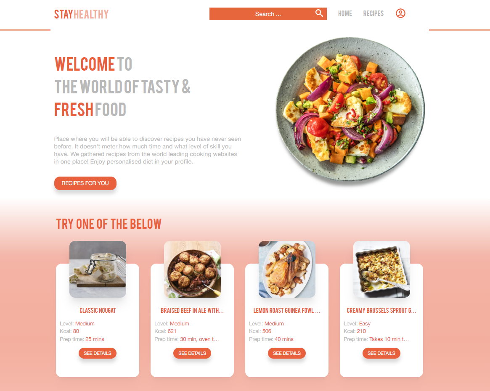

stayHealthy is a web app built on Django. It's focused on user experience, and offers personalized set of meals which are adjusted to needs of 
every user.

### ✉️ Experience it LIVE on [shealthy.herokuapp.com](https://shealthy.herokuapp.com)



---
### Technologies used

###### Python 3 libraries:
* Django
* Scrapy
* Pandas
* SQLalchemy
###### Database:
* Postgresql
###### Front-end:
* HTML
* CSS
* JavaScript
---
### Functionality
This web app allows to see recipes (around 17,000) from database and filter them by name and amount of calories. If a user wants to get personalized set of meals he needs to register and populate personal details: gender, age, weight, height, activeness level, desired number of meals/day and goal of the diet. This will allow to login, edit, see BMR/AMR/BMI metrics and access personalized set of recipes which would make total calories goal per day. The below page restricts not logged users or users without populated data.

### Login/Register forms

### Profile update (pre-filled if already registered)


#### Django specifics
The whole project is made using function based views and split in to two apps: users and recipes
Users app is taking care of:
* user registration/login/logout
* profile creation/update
* ```models.py``` - Profile model

Recipes app is responsible for:
* search recipes page
* "add recipe" form
* ```models.py``` - Recipe model


#### Calculations
Profile model has BMR/AMR/BMI fields which are calculated/recalculated when profile is created/updated. The fields are not editable, and can be changed only by the server.
###### BMR
```
bmr_base = (10 * int(self.weight_kg)) + (6.25 * int(self.height_cm)) - (5 * int(self.age))
return int(bmr_base + 5) if self.male else int(bmr_base - 161)
```
###### AMR
```
return int(self.bmr * float(self.activity_coefficient))
```
###### BMI
```
return round(self.weight_kg / float(self.height_cm)**2 * 10000, 2)
```
###### Calories per meal
Depending on goal of the diet (weight loss/gain/maintain) AMR metric is being adjusted returning amount of allowed calories per meal. Before the page is rendered ```views.py``` filters by calories per meal value. This allows to randomly pick recipes where total calories match the user's calories goal.

---

#### Custom Django forms
###### Add recipe form


---

#### Recipes search
The below is an example of search page where both logged and not logged users are able to filter data by calories and title. Results found shows number of recipes which match filter criteria. User is able to change pages with paginator at the bottom of the page. The page can be accessed by clicking Recipes button in navbar or after submitting search form from navbar.


#### Areas to improve:
1) Add calories filter to recipes search page
2) Send recipe for approval after it was added by user
3) Before adding a recipe check if URL wasn't already present in the DB
4) Extract ingredients from scraped file
5) Add allergies field to profile model and exclude recipes with such ingredient
6) Add an option to re-roll recipe from the suggested set of meals
7) Add likes to recipes and build an AI which will recommend similar meals
8) Generate shopping list with ingredients
9) Track weight changes
10) Responsiveness